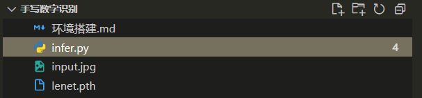

1.环境搭建

安装anaconda，[Anaconda安装以及配置环境变量 - 知乎 (zhihu.com)](https://zhuanlan.zhihu.com/p/358641541)


安装好后，在cmd命令行输入下面的命令

```shell
# 创建python虚拟环境
conda create -n lenet_env  python=3.8

# 激活刚才创建的环境
conda activate lenet_env

# 安装第三方库
conda install pytorch==1.13.0 torchvision==0.14.0 torchaudio==0.13.0 cpuonly -c pytorch
pip install -i https://pypi.tuna.tsinghua.edu.cn/simple opencv-python
```


2.   运行脚本

     

     可以手机拍照一个数字，尽量数字写的占满大半个屏幕。然后用图片替换这里的input.jpg，注意命名必须为input.jpg

     ```cmd
     # 激活刚才创建的环境
     conda activate lenet_env
     
     python infer.py #这里infer.py也可以改成绝对路径
     ```

     
