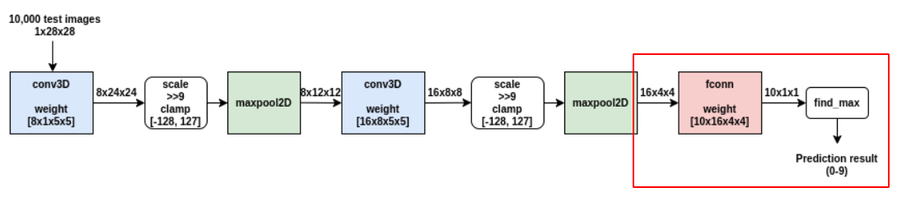
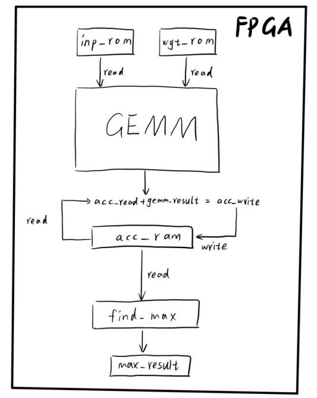

# 手写数字识别verilog项目

## 1. **要求**

- 实现LeNet5的全连接层以及找出最大结果

  

- 输入inp:1*1\*96	wgt: 1\*1\*96\*10
- 得出结果并显示在数字管上

## 2. **verilog代码实现顺序**

2.1 画图设计整体架构

2.2 创建vivado项目后利用block generator生成rom和ram(设置位宽和深度，位宽为一次想得到的数据个数*单个数据为宽**DATA_WIDTH**)

2.3 根据FPGA板的资源设计GEMM的规模，一般为2的n次方。

2.4 设计元计算单元PE模块，并在GEMM模块中进行调用。

2.5 完成GEMM和PE模块的verilog代码书写

2.6 在TOP模块中实例化各个模块，并通过状态机控制各个模块之间的协同操作。

​	一般的状态机从IDLE起始状态开始，将各个控制信号进行**初始化**，并在接受到start信号时跳变到第一个状态，然后通过设置**计数**等参数变量控制状态，完成各个状态之间的轮转，最后回到IDLE状态。

​	注意时序的控制，有的操作需要时序的对齐，常常通过**计数**或**增加一个等待状态**来完成时序的对齐从而使电路完成正确操作。

2.7 在TOP_tb.v中完成TOP模块的实例化，并设置clk时钟信号以及start信号等

## 3. 仿真实现

3.1 通过coe文件初始化rom

3.2 进行RTL仿真逐步观察计算结果

- 先看数据能否正常读入，例如inp_mem、wgt_mem中的数据是否正确
- 再看第一次计算时inp以及wgt是否正确
- 看第一次PE计算的结果是否正确，再看前几次PE计算结果。
- 看第一次GEMM计算结果是否正确
- 看第一次acc_ram的取出以及累加并写回操作是否正确

一般来说调通前两次计算后面就都会正确，因此按照正常的计算顺序正推看哪里有错，从错误的地方再反推至正确的地方这样就可以确定哪一步除了错误。

## 4.上板实现

4.1 先在仿真中消除控制信号可能引起的危险(hazard)例如XX在板上不确定是什么数据，因此应该消除所有XX给一个确定的初始值。

4.2 通过设置(* MARK_DEBUG="true" *)来上板抓信号测试是否能正常计算。

